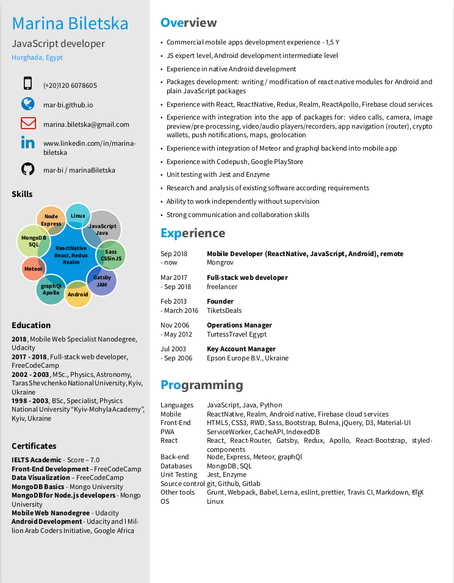

# 21 seconds LaTex resume template  

This template originates to the next templates:

1. [Carmine Spagnuolo's Twenty Seconds Curriculum Vitae](https://github.com/spagnuolocarmine/TwentySecondsCurriculumVitae-LaTex)
2. [Carmine Benedetto's Smart Fancy LaTeX CV](https://github.com/neoben/smart-fancy-latex-cv)
3. [Adrien Friggeri's Fancy CV](https://www.sharelatex.com/templates/52fb8c1f33621a613683ecad)
4. [Harsh Gadgil's Data-Engineer-Resume-LaTeX](https://github.com/opensorceror/Data-Engineer-Resume-LaTeX)

I called it **21 seconds LaTeX template**
as it has more textual information. So that, it can take more seconds to read.  
I used it to build my own **JS developer** CV.



## How it works (Ubuntu Linux)

1. Install an editor to edit and compile LaTeX documents.
It works properly in [Texmaker](http://www.xm1math.net/texmaker/) or [Kile](https://kile.sourceforge.io/).
2. Clone this repository using `git clone` and open the template.tex file in your editor.
3. Check if the next **texlive** packages are installed:
  - texlive-fonts-extra
  - texlive-luatex
  - texlive-xetex

**Important**: Make sure to compile with XeLaTeX, not PDFLaTeX.

## Updates
 - 03.02.2020 - update of cv layout and styles
 - 07.11.2021 - update of cv data

## License

```
Copyright 2018 Marina Biletska

Licensed under the Apache License, Version 2.0 (the "License");
you may not use this file except in compliance with the License.
You may obtain a copy of the License at

   http://www.apache.org/licenses/LICENSE-2.0

Unless required by applicable law or agreed to in writing, software
distributed under the License is distributed on an "AS IS" BASIS,
WITHOUT WARRANTIES OR CONDITIONS OF ANY KIND, either express or implied.
See the License for the specific language governing permissions and
limitations under the License.
```
